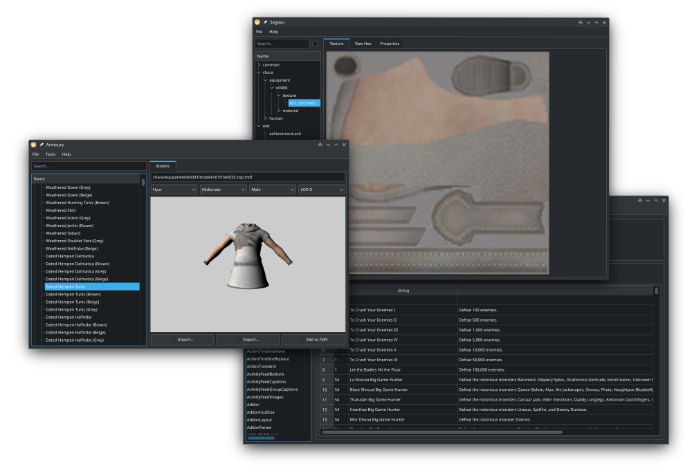

# Novus

A suite of unofficial FFXIV modding tools, including a model viewer and data archive explorer.

## Components

Here is an exhaustive list of tooling available here:

* [Argcracker](argcracker), a program that can help decrypt game arguments.
* [Gear Editor](armoury), a graphical gear and character viewer. It also supports GLTF import & export.
* [Map Editor](mapeditor), a graphical map viewer.
* [Excel Editor](karuku), a graphical program to view Excel data sheets.
* [Model Viewer](mdlviewer), a graphical model viewer for MDL files.
* [Data Viewer](sagasu), a graphical interface to explore FFXIV data archive files.

## Building

Please refer to the [building document](BUILDING.md) for instructions on how to build Novus.

## Contributing

Please refer to the [contributing document](CONTRIBUTING.md) for everything you need to know to get started contributing to Novus.

## License

This project is licensed under the [GNU General Public License 3](LICENSE). Some code or assets may be licensed differently, please refer to the [REUSE](https://reuse.software/spec/) metadata.
