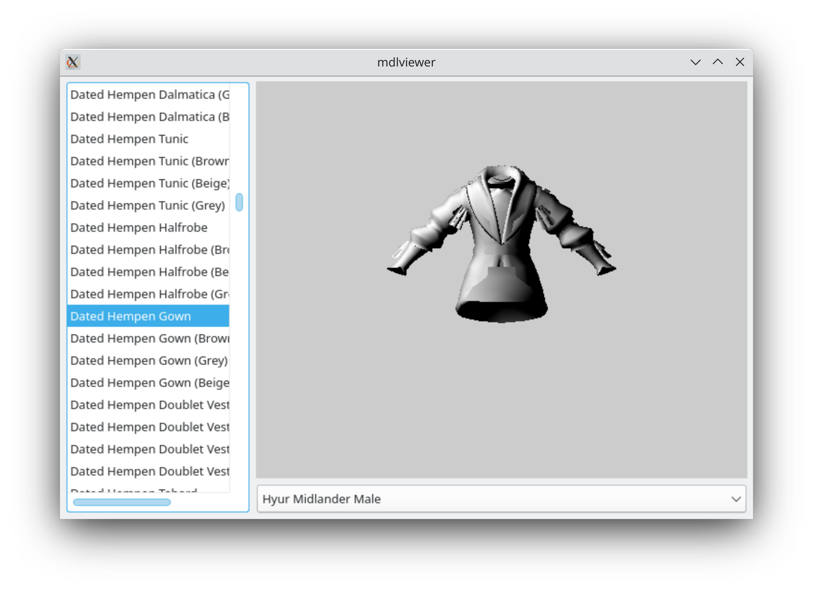

# Armoury

The Armoury can display any gear piece in the game, and includes a full model viewer and export functionality. Basic character and bone editing is supported.



## Usage

You must pass the path to your `sqpack` directory as the first argument.

```
$ mdlviewer "C:\Program Files (x86)\SquareEnix\Final Fantasy XIV\game\sqpack"
```

## Note

The viewport uses Vulkan, so it must be supported on your system in order to work.

If you're running mdlviewer on macOS (where Qt builds usually don't ship with MoltenVK unfortunatey)
mdlviewer will automatically reconfigure itself to use a standalone SDL2 window.
